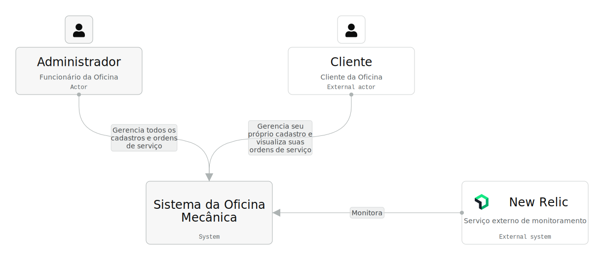
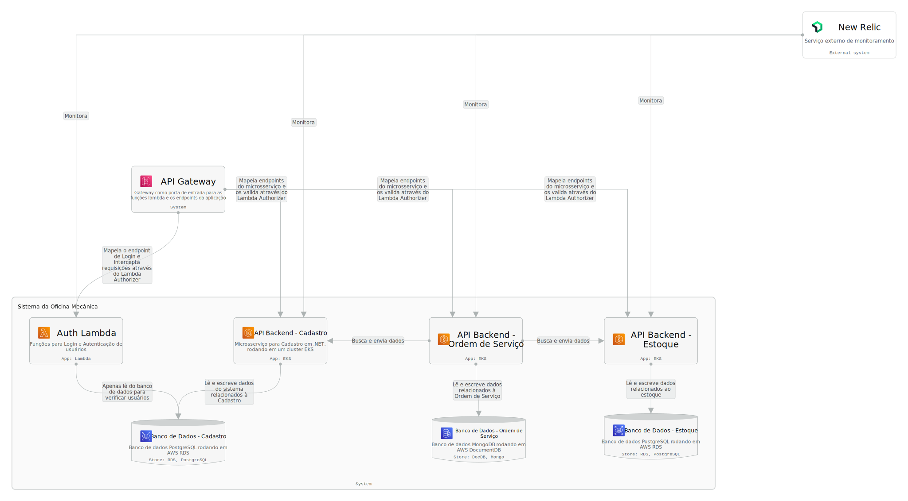
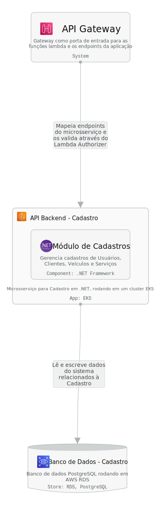

# Diagrama de componentes C4

Este é um Diagrama de Componentes que cobre as visões HLD e LLD usando o modelo C4, com visões para Contexto, Containers e Componentes. O último nível, Código, não foi utilizado pois nenhuma funcionalidade do sistema é complexa o suficiente para que este nível seja relevante.

## Diagrama interativo

[Clique aqui](https://s.icepanel.io/4GWdcqJuVDZZjG/5rah)

## Diagrama em imagens

### 1° nível - Contexto

### 2° nível - Containers

### 3° nível - Componentes - Auth Lambda

### 3° nível - Componentes - Cadastro

### 3° nível - Componentes - Ordem de Serviço

### 3° nível - Componentes - Estoque

---
Anterior: [Índice](../01.%20Entrega/2_indice.md)  
Próximo: [Banco de dados - Cadastro](../03.%20Banco%20de%20dados/1_banco_de_dados_cadastro.md)
