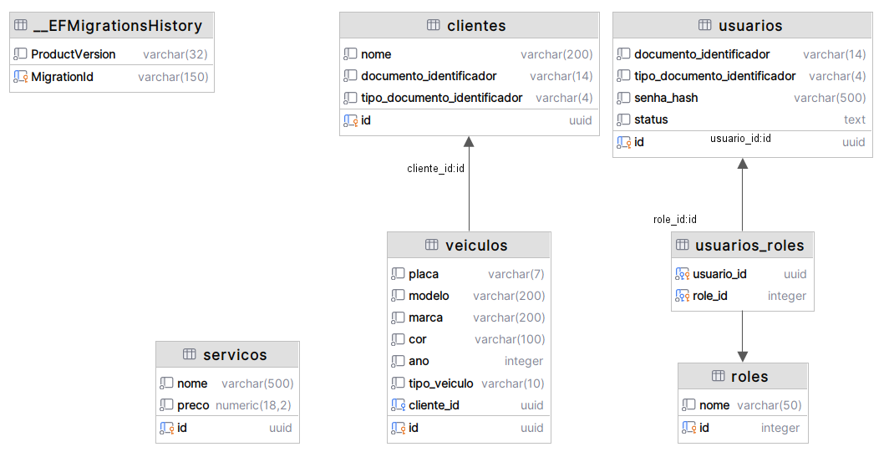

# Banco de dados - Cadastro

## Escolha do banco de dados
- **Sistema**: PostgreSQL
- **Hospedagem**: Amazon RDS
- **ORM**: Entity Framework Core
- **Terraform**: [fiap-12soat-projeto-fase-4-cadastro/terraform](https://github.com/joaosena19/fiap-12soat-projeto-fase-4-cadastro/tree/main/terraform)

O PostgreSQL foi escolhido pois os dados de cadastro são naturalmente relacionais (clientes, veículos, serviços, usuários) com diversos relacionamentos entre si. A combinação PostgreSQL + Entity Framework Core funciona muito bem com .NET e já era a stack da fase 3.

Foi adotada uma abordagem code-first, mapeando as entidades e delegando para o Entity Framework Core a criação das tabelas, definição de campos e relacionamentos.

## Diagrama de Entidade e Relacionamento

## Relacionamentos

### Clientes e Usuários

`clientes` possuem um ou mais `veiculos`. Eles são os donos dos veículos.

`usuarios` possuem diversas `roles` através da tabela auxiliar `usuarios_roles`. Eles são atores dentro do sistema que realizam ações.

`clientes` e `usuarios` não estão fisicamente ligados, eles são independentes e podem existir um sem o outro. Um cliente pode ser cadastrado no sistema sem ele diretamente acessá-lo (e.g.: atendimento de balcão), e o usuário também não necessariamente é ligado a um cliente, pois pode ser apenas um usuário administrador.

Eventualmente, clientes e usuários podem estar ligados de forma fraca através da propriedade `documento_identificador`.

### Veículos

`veiculos` estão associados a somente um `cliente`.

### Serviços

`servicos` é um catálogo de todos os serviços disponíveis na oficina, com nome, descrição e preço.

---
Anterior: [ADR 0010 - Infraestrutura Geral e Banco por Serviço](../09.%20ADRs/0010_adr_infraestrutura_geral_e_banco_por_servico.md)  
Próximo: [Banco de dados - Estoque](2_banco_de_dados_estoque.md)