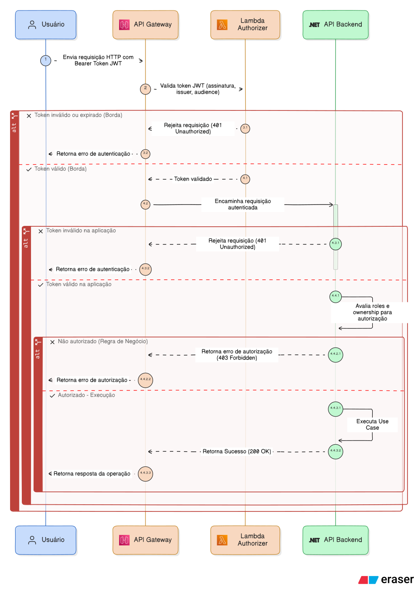

# Autenticação

## Contexto

A autenticação na fase 4 funciona da mesma forma que na fase 3. O fluxo foi mantido intacto pois funcionava perfeitamente e não havia motivo para alterá-lo.

A única diferença é que o Auth Lambda agora conecta no banco de dados do microsserviço de Cadastro ao invés do banco compartilhado do monolito. Veja mais em [ADR 0005 - Auth Lambda Conectado ao Cadastro](../09.%20ADRs/0005_adr_auth_lambda_conectado_ao_cadastro.md).

## Fluxo de Autenticação

### Login

O Login é o momento onde o usuário informa seu documento e senha, e recebe um token JWT. É feito nos seguintes passos:

1. Endpoint `auth/authenticate` recebe documento do usuário e senha
2. API Gateway chama Lambda Function
3. Lambda busca no banco de dados se usuário existe e está ativo
4. Lambda verifica se a senha do usuário está correta
5. Lambda gera token JWT e retorna através do API Gateway

### Autorização

A Autorização é feita em dois momentos, primeiramente pelo próprio API Gateway, que chama um Lambda Authorizer Function, e se ela validar o Token, daí sim a requisição chega na aplicação. Na aplicação, o Token é validado novamente (abordagem zero-trust) pelo framework do .NET, e se valido, é feito a autorização - verificar se aquele usuário autenticado tem permissão para a ação.

Funciona nos seguintes passos:

1. Requisição - com Bearer Token JWT - é feita para qualquer endpoint da aplicação
2. API Gateway chama Lambda Authorizer Function para validar o Token
3. Estando válido, a requisição chega na aplicação
4. A aplicação valida o Token novamente através do framework .NET
5. Estando válido, o módulo de Identidade verifica as roles do usuário
6. O use case específico usa as roles e ownership para permitir que a ação seja feita, ou retorna erro de autorização

### Diagrama de sequência

## Forward Token

Na comunicação entre microsserviços, adotamos o padrão de **Forward Token**. Quando o serviço de Ordem de Serviço chama o serviço de Cadastro ou Estoque, o token JWT do usuário original é propagado automaticamente no header `Authorization` das chamadas HTTP downstream.

Isso permite que cada serviço destino saiba quem é o usuário original e aplique suas próprias validações de RBAC e ownership.

Veja mais em [ADR 0006 - Geração de Token no Lambda e Forward Token](../09.%20ADRs/0006_adr_geracao_token_lambda_e_forward_token.md).

---
Anterior: [Banco de dados - Ordem de Serviço](../03.%20Banco%20de%20dados/3_banco_de_dados_ordem_servico.md)  
Próximo: [CI/CD](../05.%20CI%20%26%20CD/1_ci_cd.md)