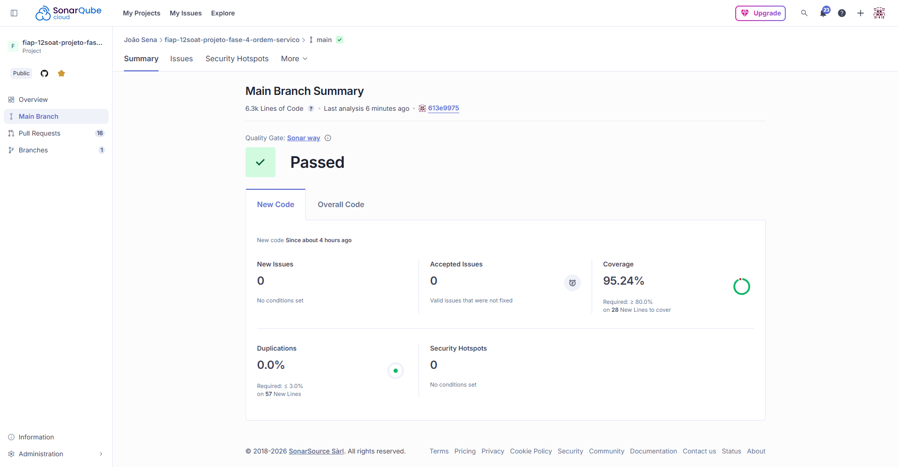
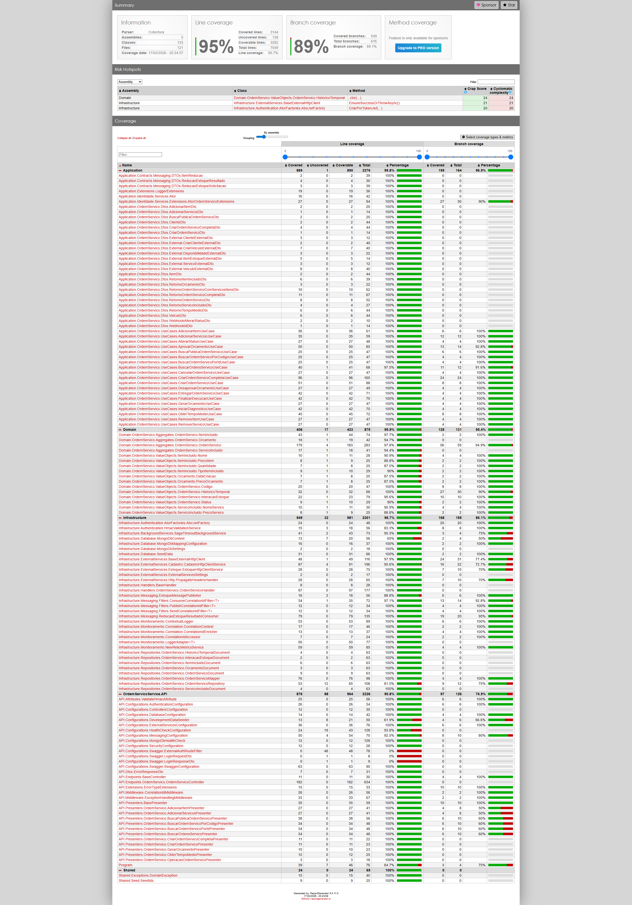

# Qualidade - Ordem de Serviço

## SonarCloud

Veja o [relatório completo no SonarCloud](https://sonarcloud.io/project/overview?id=joaosena19_fiap-12soat-projeto-fase-4-ordem-servico).

Todas as issues de severidade **Major** foram resolvidas. Algumas issues foram tratadas da seguinte forma:

- **Falsos positivos:** Issues relacionadas a keys/secrets supostamente expostas foram marcadas como falso positivo, pois os valores são injetados via **variáveis de ambiente** e não estão hardcoded no código.
- **Issues aceitas (preferência de estilo):** Foram aceitas issues como o uso do sufixo `Enum` em tipos enum e métodos com mais de 7 parâmetros, uma vez que o projeto utiliza **Builders** e **Factories** que justificam essa abordagem.

## Test Coverage

Veja o [relatório completo de cobertura](Anexos/ordem_servico_test_coverage_completo.zip) (download do HTML).

## Proteção de Branch

A branch `main` está protegida contra push direto. Toda alteração precisa ser feita via Pull Request, e o CI Gate deve passar com sucesso antes do merge.

---
Anterior: [Qualidade - Estoque](2_qualidade_estoque.md)  
Próximo: [Qualidade - Auth Lambda](4_qualidade_auth_lambda.md)
