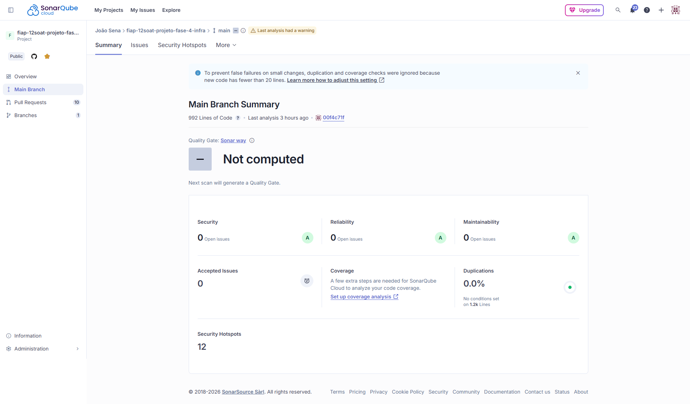

# Qualidade - Infraestrutura

## SonarCloud

Veja o [relatório completo no SonarCloud](https://sonarcloud.io/project/overview?id=joaosena19_fiap-12soat-projeto-fase-4-infra).

Todas as issues de severidade **Major** foram resolvidas. Algumas issues foram tratadas da seguinte forma:

- **Falsos positivos:** Issues relacionadas a keys/secrets supostamente expostas foram marcadas como falso positivo, pois os valores são injetados via **variáveis de ambiente** e não estão hardcoded no código.

## Test Coverage

O repositório de infraestrutura não possui testes unitários, pois é composto apenas por módulos Terraform.

## Proteção de Branch

A branch `main` está protegida contra push direto. Toda alteração precisa ser feita via Pull Request, e o CI Gate deve passar com sucesso antes do merge.

---
Anterior: [Qualidade - Auth Lambda](4_qualidade_auth_lambda.md)  
Próximo: [BDD](6_BDD.md)
