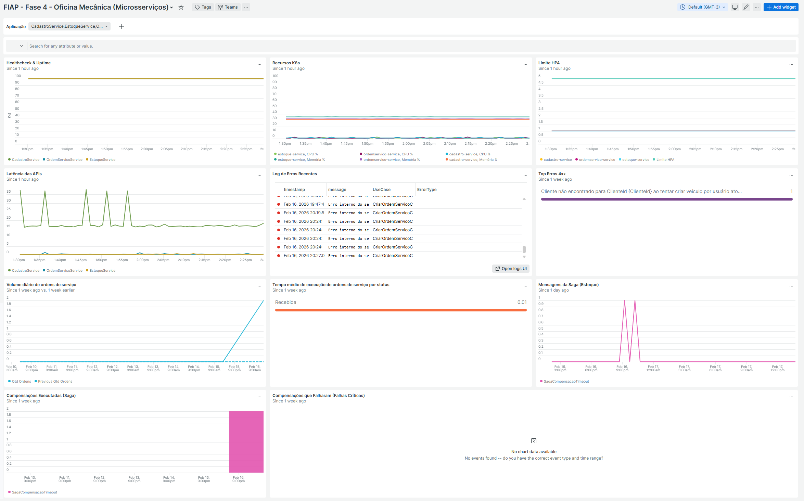
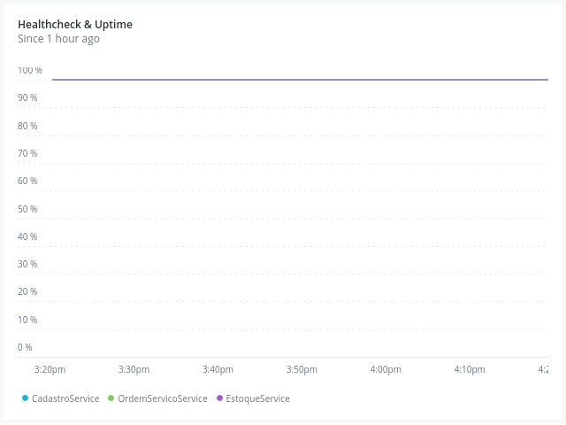
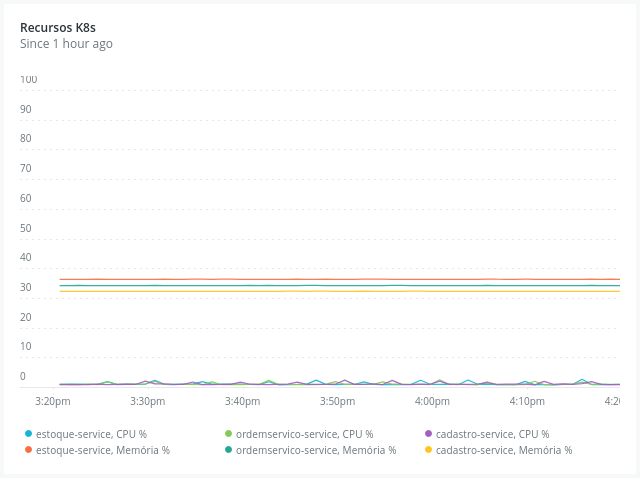
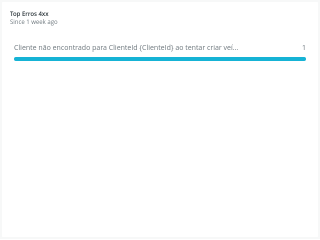

# Plano de monitoramento

## New Relic
Assim como na fase 3, o New Relic foi mantido como ferramenta de monitoramento.

## Log estruturado na aplicação

Assim como na fase 3, a aplicação continua utilizando a interface **ILogger** do .NET para registrar logs estruturados. Cada um dos UseCases está dentro de uma lógica de try/catch que captura erros tratados e os loga como Information, e erros inesperados são logados como Error.

Exemplo:

```csharp
    public async Task ExecutarAsync(Ator ator, [... parâmetros do caso de uso ...])
    {
        try
        {
            [... lógica do caso de uso ...]
        }
        catch (DomainException ex)
        {
            logger.ComUseCase(this)
                  .ComAtor(ator)
                  .ComDomainErrorType(ex)
                  .LogInformation(ex.LogTemplate, ex.LogArgs);

            presenter.ApresentarErro(ex.Message, ex.ErrorType);
        }
        catch (Exception ex)
        {
            logger.ComUseCase(this)
                  .ComAtor(ator)
                  .LogError(ex, "Erro interno do servidor.");

            presenter.ApresentarErro("Erro interno do servidor.", ErrorType.UnexpectedError);
        }
    }
```

## CorrelationId

Foi implementada a geração e propagação do `CorrelationId` entre todas as APIs e mensagaria. Quando uma requisição atravessar múltiplos serviços, cada log manterá o mesmo `CorrelationId`, assim podemos rastrear todo o fluxo da requisição.

### Como funciona
O mecanismo de propagação do CorrelationId é implementado em **todas as APIs** da fase 4 (Ordem de Serviço, Estoque e Cadastro) através de camadas complementares:

#### 1. Middleware HTTP (`CorrelationIdMiddleware`)
Cada requisição HTTP que chega na API passa por um middleware que:
- Lê o header `X-Correlation-ID` da requisição
- Se o header estiver ausente, **gera um novo GUID** automaticamente
- Inclui o CorrelationId no **header da resposta**, permitindo que o chamador identifique a correlação
- Estabelece dois escopos no pipeline:
  - **`CorrelationContext.Push()`**: armazena o ID em um `AsyncLocal<string>`, acessível em qualquer ponto da thread assíncrona (HTTP, consumers, background services)
  - **`LogContext.PushProperty()`**: enriquece automaticamente todos os logs do Serilog com a propriedade `CorrelationId`

```csharp
using (CorrelationContext.Push(correlationId))
using (LogContext.PushProperty(CorrelationConstants.LogPropertyName, correlationId))
{
    await _next(context);
}
```

#### 2. Propagação HTTP entre serviços (`PropagateHeadersHandler`)
Quando um microsserviço faz chamadas HTTP para outro (ex: Ordem de Serviço → Cadastro para buscar cliente), o `PropagateHeadersHandler` (um `DelegatingHandler`) injeta automaticamente:
- O header `Authorization` (token Bearer do usuário)
- O header `X-Correlation-ID` obtido via `ICorrelationIdAccessor`

Isso garante que o serviço destino receba o mesmo CorrelationId e todos os logs daquela cadeia de chamadas sejam correlacionáveis.

#### 3. Propagação em mensageria (filtros MassTransit)
Para comunicação assíncrona via Amazon SQS, três filtros MassTransit garantem a propagação:

| Filtro | Direção | Função |
|--------|---------|--------|
| `PublishCorrelationIdFilter` | Publicação | Lê o `CorrelationContext.Current` e adiciona ao header e envelope da mensagem |
| `SendCorrelationIdFilter` | Envio direto | Mesmo comportamento para `Send` (ponto a ponto) |
| `ConsumeCorrelationIdFilter` | Consumo | Extrai o CorrelationId da mensagem (header → envelope → propriedade da mensagem → novo GUID) e estabelece os escopos `CorrelationContext` + `LogContext` |

O `ConsumeCorrelationIdFilter` segue uma **ordem de precedência** para resolver o CorrelationId:
1. Header `X-Correlation-ID`
2. Envelope `CorrelationId` do MassTransit 
3. Propriedade `CorrelationId` na mensagem
4. Gera novo GUID como fallback

#### 4. Acesso via `ICorrelationIdAccessor`
A interface `ICorrelationIdAccessor` abstrai o acesso ao CorrelationId para a camada de Application. A implementação `CorrelationIdAccessor` lê do `CorrelationContext` (funciona tanto em contexto HTTP quanto em consumers e background services).

#### 5. Enriquecimento via `CorrelationIdEnricher`
Um enricher Serilog (`CorrelationIdEnricher`) garante que, mesmo quando o `LogContext.PushProperty` não foi acionado, o CorrelationId do `CorrelationContext.Current` seja adicionado aos eventos de log como fallback.

### Fluxo completo de exemplo (Saga de Estoque)

```
[Cliente] → HTTP POST /aprovar (com ou sem X-Correlation-ID)
   │
   ├── Middleware gera/preserva CorrelationId = "abc-123"
   │
   ├── AprovarOrcamentoUseCase loga com CorrelationId enriquecido
   │   └── Cria ReducaoEstoqueSolicitacao { CorrelationId = "abc-123" }
   │       └── PublishCorrelationIdFilter propaga no header da mensagem SQS
   │
   ├── [Serviço Estoque] ConsumeCorrelationIdFilter extrai "abc-123"
   │   └── Todos os logs do consumer têm CorrelationId = "abc-123"
   │   └── Publica ReducaoEstoqueResultado { CorrelationId = "abc-123" }
   │
   └── [Serviço OS] ReducaoEstoqueResultadoConsumer recebe resultado
       └── Logs de confirmação/compensação incluem CorrelationId = "abc-123"
```

Com isso, uma busca por `CorrelationId = "abc-123"` no **New Relic** retorna todos os logs de todos os serviços envolvidos naquela operação.

## Custom events para SAGA

A saga coreografada de redução de estoque é monitorada através de **custom events do New Relic**, registrados pela implementação `NewRelicMetricsService` (interface `IMetricsService`). Cada evento é enviado via `NewRelic.RecordCustomEvent()` com atributos contextuais.

### Outros custom events
Eventos da fase 3, sobre ciclo de vida da OS, também foram mantidos

| Evento | Quando é disparado | Atributos |
|--------|-------------------|-----------|
| `OrdemServicoCriada` | Ao criar uma nova OS | `OrdemServicoId`, `ClienteId`, `UsuarioId` |
| `OrdemServicoMudancaStatus` | A cada transição de status | `OrdemServicoId`, `StatusAnterior`, `StatusNovo`, `DuracaoMs` |

### Eventos de Saga (redução de estoque)

| Evento | Quando é disparado | Atributos |
|--------|-------------------|-----------|
| `SagaEstoqueConfirmado` | Estoque reduzido com sucesso | `ordemServicoId`, `statusAtual`, `correlationId`, `timestamp` |
| `SagaCompensacaoFalhaEstoque` | Estoque recusado (insuficiente, erro, etc.) | `ordemServicoId`, `motivo`, `correlationId`, `timestamp` |
| `SagaCompensacaoTimeout` | Background service detectou timeout (90s) | `ordemServicoId`, `motivo`, `dataInicioExecucao`, `sucesso` |
| `SagaCompensacaoFalhaCritica` | Erro ao executar a compensação | `ordemServicoId`, `erro`, `correlationId`, `timestamp` |
## Dashboard New Relic
### Dashboard completo
Este é o dashboard de monitoramento da aplicação no New Relic, que o mesmo padrão da fase 3, mas adicionando alguns widgets novos relacionados à SAGA, adiciona variável seletora de aplicação, e altera as queries para lideram com mais de uma aplicação.



### Novos Widgets

Estes foram os novos widgets criados para monitoramento da SAGA

#### Mensagens da Saga (estoque)

Monitora mensagens que estão sendo disparadas relacianadas as SAGAS. É criado na aplicação através dos Custom Events `SagaEstoqueConfirmado`, `SagaCompensacaoFalhaEstoque`, `SagaCompensacaoTimeout` e `SagaCompensacaoFalhaCritica`.


**Query:**
```sql
SELECT count(*) FROM SagaEstoqueConfirmado, SagaCompensacaoFalhaEstoque, SagaCompensacaoTimeout, SagaCompensacaoFalhaCritica FACET eventType() SINCE 1 day ago TIMESERIES
```

#### Compensações executadas (Saga)

Monitora compensações realizadas pela SAGAS. É criado na aplicação através dos Custom Events `SagaCompensacaoFalhaEstoque`, `SagaCompensacaoTimeout`.


**Query:**
```sql
SELECT count(*) as 'Compensações' FROM SagaCompensacaoFalhaEstoque, SagaCompensacaoTimeout FACET eventType() SINCE 1 week ago TIMESERIES 1 day
```

#### Compensações que Falharam (Falhas Críticas)

Monitora compensações que falharam em compensar, o que é uma falha crítica pois gera dados inconsistentes nos bancos. É criado na aplicação através dos Custom Events `SagaCompensacaoFalhaCritica`.


**Query:**
```sql
SELECT timestamp, ordemServicoId, erro, correlationId FROM SagaCompensacaoFalhaCritica SINCE 1 week ago LIMIT 50
```

### Seletor de aplicação

Foi adicionado uma variável seletora de aplicação, que filtra os widgets do dashboard para as aplicações escolhidas.


### Alertas

Temos 3 alertas configurados no New Relic:

1 - **Erro - Ordem de Serviço**, que notifica caso hajam erros envolvendo use cases da Ordem de Serviço
2 - **Saga - Alta Taxa de Rollbacks**, que notifica caso estejamos tendo muitas compensações via SAGA
3 - **Saga - Falha Crítica de Consistência**, que notifica caso acontece qualquer falha na compensação, pois é uma situação crítica que gerou dados inconsistentes nos bancos.


### Widgets antigos

Estes são os mesmos widgets da fase 3, adaptados para multi-aplicações com variável seletora `{{appName}}` e `FACET` por aplicação.

#### Healthcheck & Uptime

Monitora a disponibilidade da API através da taxa de sucesso das requisições, indicando se a aplicação está conseguindo atender às requisições.



**Query:**
```sql
SELECT percentage(count(*), WHERE httpResponseCode NOT LIKE '5%') as 'Disponibilidade' FROM Transaction WHERE appName IN ({{appName}}) FACET appName SINCE 1 hour ago TIMESERIES
```

#### Recursos K8s

Acompanha o consumo percentual de CPU e Memória dos containers em relação aos limites (limits) definidos no Kubernetes.



**Query:**
```sql
SELECT (max(cpuUsedCores) / max(cpuLimitCores)) * 100 as 'CPU %', (max(memoryWorkingSetBytes) / max(memoryLimitBytes)) * 100 as 'Memória %' FROM K8sContainerSample WHERE containerName IN ('ordemservico-service', 'estoque-service', 'cadastro-service') FACET containerName SINCE 1 hour ago TIMESERIES
```

#### Limite HPA

Monitora a quantidade de pods ativos e o limite configurado no HPA.


**Query 1:**
```sql
SELECT uniqueCount(podName) as 'Pods Ativos' FROM K8sPodSample WHERE deploymentName IN ('ordemservico-service', 'estoque-service', 'cadastro-service') AND status = 'Running' FACET deploymentName SINCE 1 hour ago TIMESERIES
```

**Query 2:**
```sql
SELECT 5 as 'Limite HPA' FROM K8sPodSample SINCE 1 hour ago TIMESERIES
```

#### Latência das APIs

Exibe o tempo médio de resposta das transações.


**Query:**
```sql
SELECT average(duration) * 1000 as 'Latência (ms)' FROM Transaction WHERE appName IN ({{appName}}) FACET appName TIMESERIES
```

#### Log de Erros Recentes

Lista os últimos 50 erros e falhas críticos registrados nos logs da aplicação, útil para monitorar erros imediatos.


**Query:**
```sql
SELECT timestamp, message, UseCase, ErrorType FROM Log WHERE level = 'Error' AND application IN ({{appName}}) SINCE 1 day ago LIMIT 50
```

#### Top Erros 4xx

Este widget mostra os erros 4xx mais frequentes na aplicação. São erros tratados causados por requisições inválidas dos clientes. É útil para descobrirmos onde os clientes estão errando e melhorar a usabilidade do sistema.



**Query:**
```sql
SELECT count(*) as 'Ocorrências' FROM Log WHERE (level = 'INFORMATION' OR level = 'Information' OR level = 'info') AND application IN ({{appName}}) AND trace.id IN (SELECT traceId FROM Transaction WHERE http.statusCode >= 400 AND http.statusCode < 500 LIMIT MAX) FACET message_template SINCE 1 week ago LIMIT 10
```

#### Volume diário de ordens de serviço

Contabiliza novas ordens de serviço criadas diariamente, comparando com a semana anterior para medir a tendência de demanda do negócio.

É criado na aplicação através do Custom Event `OrdemServicoCriada`.


**Query:**
```sql
SELECT count(*) as 'Qtd Ordens' FROM OrdemServicoCriada SINCE 1 week ago TIMESERIES 1 day COMPARE WITH 1 week ago
```

#### Tempo médio de execução de ordens de serviço por status

Calcula o tempo médio que uma OS permanece em certos status antes de avançar. Status analisados: 'Em Diagnóstico', 'Em Execução', 'Finalizada'.

É criado na aplicação através do Custom Event `OrdemServicoMudancaStatus`.


**Query:**
```sql
SELECT average(DuracaoMs) / 1000 / 60 / 60 as 'Horas' FROM OrdemServicoMudancaStatus FACET StatusAnterior SINCE 1 week ago
```

---
Anterior: [CI/CD](../5.%20CI%20%26%20CD/1_ci_cd.md)
Próximo: [Qualidade - Cadastro](../8.%20Testes%20e%20qualidade/1_qualidade_cadastro.md)