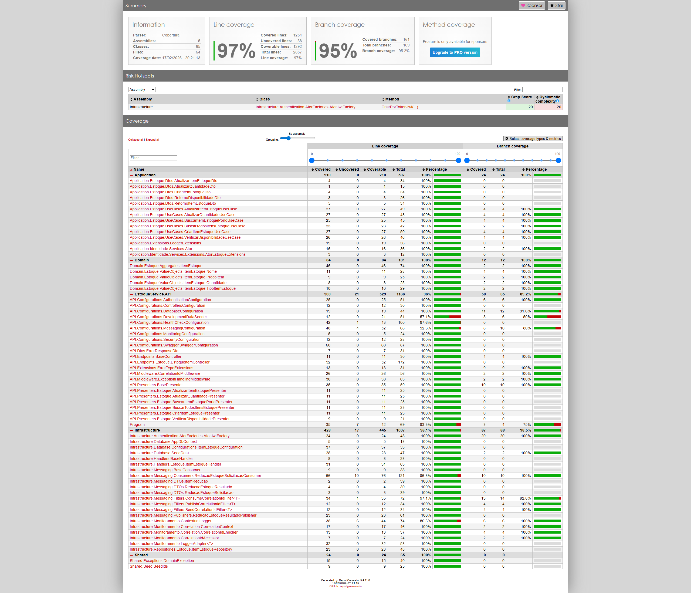

# Qualidade - Estoque

## SonarCloud

Veja o [relatório completo no SonarCloud](https://sonarcloud.io/project/overview?id=joaosena19_fiap-12soat-projeto-fase-4-estoque).

> TODO: Adicionar print do SonarCloud

## Test Coverage

Veja o [relatório completo de cobertura](Anexos/estoque_test_coverage_completo.zip) (download do HTML).

## Proteção de Branch

A branch `main` está protegida contra push direto. Toda alteração precisa ser feita via Pull Request, e o CI Gate deve passar com sucesso antes do merge.

---
Anterior: [Qualidade - Cadastro](1_qualidade_cadastro.md)  
Próximo: [Qualidade - Ordem de Serviço](3_qualidade_ordem_servico.md)
